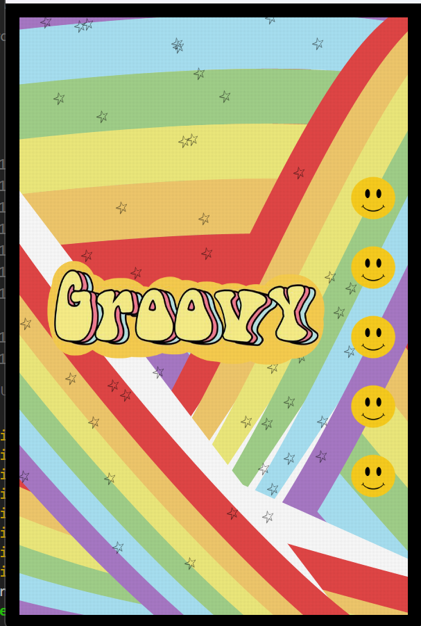

# Processing Poster Project

This project is a visual poster created using Processing for the *Creative Programming for Design* course during the first semester of 2021 at the Pontifical Catholic University of Chile. The poster incorporates vibrant, flowing curves and multiple design elements like stars and images to create a dynamic and colorful composition.

## Project Context

The objective of this project was to explore creative visual design and composition using Processing. The artwork combines curves of varying thicknesses, smooth animations, and the use of images to produce a visually engaging poster. This project demonstrates Processing’s ability to handle complex graphics and patterns.

## How to Run the Project

### Requirements

To run this project, you will need:

- [Processing](https://processing.org/download/) installed on your machine.
- The images `happy.png`, `groovy.png`, and `star.png` saved in the same directory as the `.pde` file.

### Steps

1. Download or clone the project files.
2. Ensure the `happy.png`, `groovy.png`, and `star.png` image files are available in the same folder as the Processing sketch.
3. Open the `.pde` file in the Processing IDE.
4. Press the `Run` button (the triangle in the top-left corner of the Processing window) to render the poster.

### Code Overview

- **Curved Lines**: The poster uses multiple layers of curves, drawn using the `curve()` function. These curves are generated with varying colors from a predefined rainbow palette and thicknesses, creating a flowing, layered effect.
- **Images**: The poster includes three images (`happy.png`, `groovy.png`, and `star.png`) which are used as part of the visual design. Stars are randomly placed on the canvas, while the `happy.png` image is repeated vertically, and `groovy.png` serves as a central logo.
- **Random Stars**: Stars are randomly distributed across the poster with a semi-transparent effect, giving the composition an extra decorative touch.
- **Background Elements**: Black rectangles are drawn at the edges of the canvas to frame the design and focus attention on the colorful curves and images.

### Features

- **Rainbow Curves**: Smooth curves with gradient-like color transitions, representing the primary design element of the poster.
- **Image Integration**: Custom images (`happy.png`, `groovy.png`, and `star.png`) are resized and positioned within the design, enhancing the visual appeal.
- **Randomized Star Placement**: Randomly placed stars add a sense of randomness and movement to the poster.
